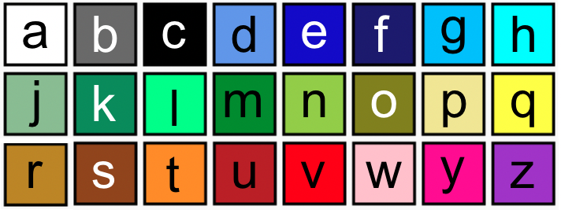

--- code ---
---
language: python 
filename: main.py 
line_numbers: false 
line_number_start:
line_highlights:
---
 # Farbpalette 
 a = (255, 255, 255) # weiß 
 b = (105, 105, 105) # dunkelgrau 
 c = (0, 0, 0) # schwarz 
 d = (100, 149, 237) # kornblumenblau 
 e = (0, 0, 205) # mittelblau 
 f = (25, 25, 112) # mitternachtsblau 
 g = (0, 191, 255) # tiefes himmelblau 
 h = (0, 255, 255) # cyan 
 j = (143, 188, 143) # dunkles meeresgrün 
 k = (46, 139, 87) # meeresgrün 
 l = (0, 255, 127) # frühlingsgrün 
 m = (34, 139, 34) # waldgrün 
 n = (154, 205, 50) # gelbgrün    
 o = (128, 128, 0) # oliv 
 p = (240, 230, 140) # khaki 
 q = (255, 255, 0) # gelb 
 r = ( 184, 134, 11) # dunkles goldrute 
 s = (139, 69, 19) # sattelbraun 
 t = (255, 140, 0) # dunkelorange 
 u = (178, 34, 34) # schamott 
 v = (255, 0, 0) # rot 
 w = (255, 192, 203) # rosa 
 y = (255, 20, 147) # dunkelrosa 
 z = (153, 50, 204) # dunkelorchidee

--- /code ---
