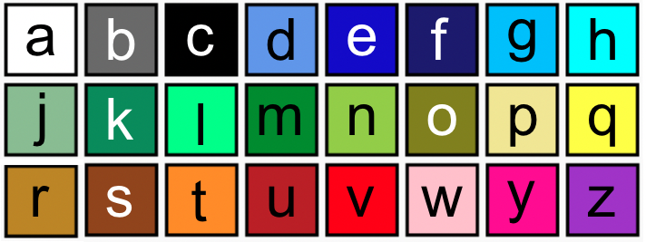

--- code ---
---
language: python 
filename: main.py 
line_numbers: false 
line_number_start:
line_highlights:
---
 # Paleta de colores 
 a = (255, 255, 255) # Blanco 
 b = (105, 105, 105) # Gris apagado 
 c = (0, 0, 0) # Negro 
 d = (100, 149, 237) # Azul flor de maíz 
 e = (0, 0, 205) # Azul intermedio 
 f = (25, 25, 112) # Azul medianoche 
 g = (0, 191, 255) # Azul cielo profundio 
 h = (0, 255, 255) # Cian 
 j = (143, 188, 143) # Verde mar produndo 
 k = (46, 139, 87) # Verde mar 
 l = (0, 255, 127) # Verde primavera 
 m = (34, 139, 34) # Verde foresta 
 n = (154, 205, 50) # AmarilloVerde    
 o = (128, 128, 0) # Oliva 
 p = (240, 230, 140) # Caqui 
 q = (255, 255, 0) # Amarillo 
 r = ( 184, 134, 11) # Dorado oscuro 
 s = (139, 69, 19) # Marrón silla de montar 
 t = (255, 140, 0) # Anaranjado oscuro 
 u = (178, 34, 34) # Ladrillo 
 v = (255, 0, 0) # Rojo 
 w = (255, 192, 203) # Rosado 
 y = (255, 20, 147) # Rosado profundo 
 z = (153, 50, 204) # Orquídea oscura

--- /code ---
