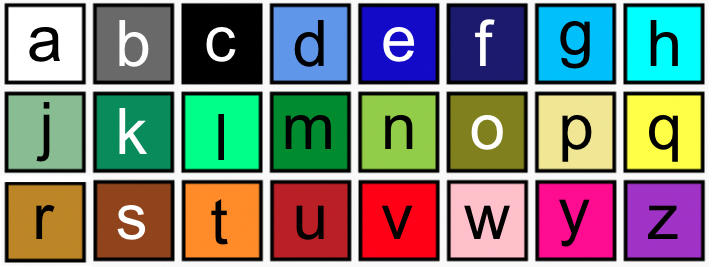

--- code ---
---
language: python filename: main.py line_numbers: false line_number_start:
line_highlights:
---
 # Paleta de cores a = (255, 255, 255) # Branco b = (105, 105, 105) # Cinzento escuro c = (0, 0, 0) # Preto d = (100, 149, 237) # Azúl centáurea e = (0, 0, 205) # Azul Médio f = (25, 25, 112) # Azul Meia-noite g = (0, 191, 255) # Azul Céu escuro h = (0, 255, 255) # Ciano j = (143, 188, 143) # Verde Mar Escuro k = (46, 139, 87) # Verde Mar l = (0, 255, 127) # Verde Primavera m = (34, 139, 34) # Verde Floresta n = (154, 205, 50) # Amarelo Verde    
o = (128, 128, 0) # Oliveira p = (240, 230, 140) # Caqui q = (255, 255, 0) # Amarelo r = ( 184, 134, 11) # Dourado Escuro s = (139, 69, 19) # Castanho t = (255, 140, 0) # Laranja Escuro u = (178, 34, 34) # Vermelho Tijolo v = (255, 0, 0) # Vermelho w = (255, 192, 203) # Rosa y = (255, 20, 147) # Rosa Escuro z = (153, 50, 204) # Orquídea Escuro

--- /code ---
